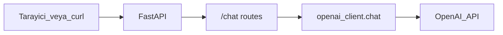

# Faz 1: Temel ve İlk API

**Tarih:** 2026-05-19  
**Durum:** Tamamlandı (API key senin `.env` ile test edilecek)

---

## Bu fazda ne öğrendik?

### LLM API nasıl çalışır?

1. **İstek:** Kullanıcı metni + isteğe bağlı system prompt → OpenAI Chat Completions API.
2. **Yanıt:** Model üretilen metni döner (`choices[0].message.content`).
3. **Model:** `gpt-4o-mini` — hızlı ve ucuz; RAG için yeterli kalite.

### System vs user message

| Rol | Amaç |
|-----|------|
| `system` | Botun davranışı (ton, dil, kurallar) |
| `user` | Kullanıcının sorusu |

Faz 1’de system prompt: kısa bir “yardımcı destek asistanı” tanımı (`src/llm/openai_client.py`).

### FastAPI

- `GET /health` → sunucu ayakta mı, API key var mı?
- `POST /chat` → JSON body ile soru, JSON ile cevap
- `/docs` → otomatik Swagger — endpoint’leri tarayıcıdan dene

### Ortam değişkenleri

- Hassas bilgi (API key) **`.env`** dosyasında
- `.env.example` → şablon (git’e girer)
- `.env` → gerçek key (git’e **girmez**)

---

## Mimari (Faz 1)



Henüz **RAG yok**: model sadece eğitim verisi + system prompt ile cevap verir. Faz 3’te araya Chroma retrieval eklenecek.

---

## Oluşturulan dosyalar

| Dosya | Görevi |
|-------|--------|
| `src/main.py` | Uygulama girişi, `/health` |
| `src/config.py` | `.env` okuma (pydantic-settings) |
| `src/llm/openai_client.py` | OpenAI client + `chat()` |
| `src/api/routes_chat.py` | `POST /chat` |
| `requirements.txt` | Bağımlılıklar |
| `.env.example` | Key şablonu |

---

## Kararlar ve nedenleri

| Karar | Neden |
|-------|--------|
| FastAPI | Async hazır, otomatik OpenAPI docs, iş piyasasında yaygın |
| `pydantic-settings` | Tip güvenli config, `.env` otomatik yükleme |
| Key yoksa `503` | Sunucu çalışır; hata mesajı net |
| `rag_enabled: false` | İleride UI/client aynı endpoint’i kullanacak; faz ayrımı belli |

---

## Test checklist

- [ ] `pip install -r requirements.txt`
- [ ] `.env` oluştur, `OPENAI_API_KEY` gir
- [ ] `uvicorn src.main:app --reload`
- [ ] `GET /health` → `"openai_configured": true`
- [ ] `POST /chat` → `{"message": "TaskFlow nedir?"}` → anlamlı cevap (henüz uydurma olabilir — RAG yok)

### Örnek curl (PowerShell)

```powershell
Invoke-RestMethod -Uri http://127.0.0.1:8000/health

Invoke-RestMethod -Uri http://127.0.0.1:8000/chat -Method Post `
  -ContentType "application/json" `
  -Body '{"message": "Merhaba, nasılsın?"}'
```

---

## Karşılaşılabilecek sorunlar

| Sorun | Çözüm |
|-------|--------|
| `503 OPENAI_API_KEY is not configured` | `.env` oluştur, key yapıştır, sunucuyu yeniden başlat |
| `ModuleNotFoundError: src` | Proje kökünden çalıştır: `uvicorn src.main:app` |
| `502 OpenAI API error` | Key geçersiz, kota bitmiş veya ağ — OpenAI dashboard kontrol |

---

## Metrikler / maliyet (Faz 1)

- Her `/chat` çağrısı: kısa soru ~ birkaç yüz token → **~$0.0001–0.0003** mertebesi
- Faz 1 testleri (20–30 mesaj): **ihmal edilebilir**

---

## Sonraki faza notlar (Faz 2)

- `data/knowledge_base/` altında TaskFlow MD dosyaları
- Chunking + `text-embedding-3-small` + Chroma
- `scripts/ingest.py` ile indexleme
- `/chat` henüz değişmez; Faz 3’te RAG bağlanır

---

## Senin notların (doldur)

Öğrendiğin / takıldığın yerler:

```
“RAG olmadan model TaskFlow’u genel anlamda anlattı, ürün bilgisi yok.”
```
