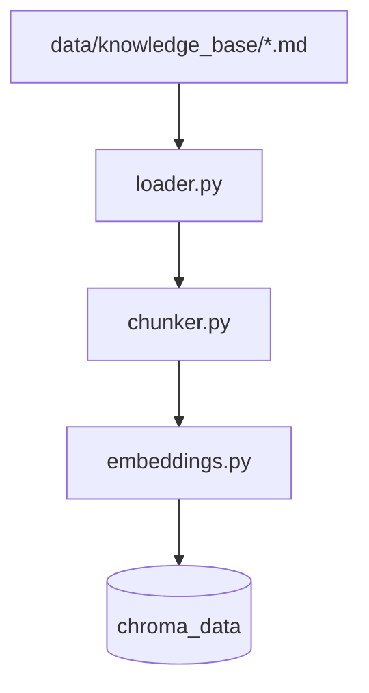

# Faz 2: Bilgi Tabanı ve Ingestion

**Tarih:** 2026-05-19  
**Durum:** Tamamlandı (`python scripts/ingest.py` çalıştırılmalı)

---

## Bu fazda ne öğrendik?

### RAG’in “R” kısmı: Retrieval hazırlığı

RAG = **Retrieval** + **Augmented** + **Generation**. Faz 2 yalnızca retrieval için veriyi hazırlar:

1. **Kaynak:** Markdown dosyaları (`data/knowledge_base/`)
2. **Chunk:** Uzun metni arama için küçük parçalara bölme
3. **Embedding:** Her parçayı sayısal vektöre çevirme (anlam uzayı)
4. **Vector DB:** Vektörleri saklayıp “en benzer parça” araması (Chroma)

Faz 3’te kullanıcı sorusu da embed edilip aynı DB’de aranacak; bulunan parçalar LLM’e bağlam olarak verilecek.

### Chunking neden gerekli?

- LLM’in tek seferde okuyabileceği metin sınırı var.
- Tüm dokümanı tek vektör yapmak → detay kaybı.
- Küçük parçalar → soruya daha isabetli eşleşme.

**Bu projedeki ayar:** `chunk_size=800` karakter, `chunk_overlap=100`.

| Parametre | Değer | Anlam |
|-----------|--------|--------|
| chunk_size | 800 | Her parçanın max uzunluğu |
| overlap | 100 | Komşu parçaların paylaştığı metin (cümle ortasında kesilmeyi azaltır) |

### Embedding

OpenAI `text-embedding-3-small`: metni ~1536 boyutlu vektöre çevirir. Benzer anlamlı metinler vektör uzayında birbirine yakın olur.

### Chroma

- Yerel klasör: `chroma_data/` (kalıcı disk)
- Collection adı: `taskflow_support`
- Benzerlik: cosine (açı tabanlı)

---

## Mimari (Faz 2)



`/chat` henüz Chroma’ya **bağlı değil** — Faz 3’te bağlanacak.

---

## Oluşturulan dosyalar

| Dosya | Görev |
|-------|--------|
| `data/knowledge_base/*.md` | TaskFlow kurgusal dokümantasyon (7 dosya) |
| `src/ingestion/loader.py` | MD okuma |
| `src/ingestion/chunker.py` | Parçalama |
| `src/ingestion/indexer.py` | Embed + Chroma upsert |
| `src/llm/embeddings.py` | OpenAI embedding API |
| `scripts/ingest.py` | CLI ingest |
| `src/config.py` | chunk/chroma yolları |

---

## TaskFlow bilgi tabanı (özet)

Kurgusal ürün; bot Faz 3’te bunlardan cevap üretecek:

| Konu | Örnek gerçek |
|------|----------------|
| Free plan | 3 proje, 5 üye |
| Pro fiyat | 12 USD / kullanıcı / ay |
| SSO | Yalnızca Enterprise, SAML 2.0 |
| API Free | 100 istek / dakika |

---

## Kararlar ve nedenleri

| Karar | Neden |
|-------|--------|
| Karakter bazlı chunk | Basit, bağımlılık yok; öğrenmek için yeterli |
| 800 / 100 | MD dosyaları kısa; FAQ cümleleri tek chunk’a sığar |
| `upsert` + id `dosya::index` | Aynı ingest tekrar çalışınca duplicate olmaz |
| `--reset` | Collection sıfırdan kurmak için |

---

## Çalıştırma

```powershell
cd C:\Users\Abdullah\Desktop\AgeofAgents
.\.venv\Scripts\Activate.ps1
pip install -r requirements.txt
python scripts/ingest.py --reset
```

Beklenen çıktı örneği:

```
Documents:  7
Chunks:     (yaklaşık 15-25, içeriğe bağlı)
In Chroma:  (chunks ile aynı)
```

`/health` → `"index": { "chunk_count": ... }` sıfırdan büyük olmalı.

---

## Maliyet (Faz 2)

- Tüm chunk’lar tek sefer embed: genelde **<$0.01**
- `--reset` ile tekrar ingest: yine çok düşük

---

## Sonraki faz (Faz 3)

- `retriever.py`: soru → embed → Chroma top-k
- `generator.py`: bağlam + kurallı prompt → cevap + kaynaklar
- `/chat` → `rag_enabled: true`

---

## Senin notların

```
(buraya yaz)
```
