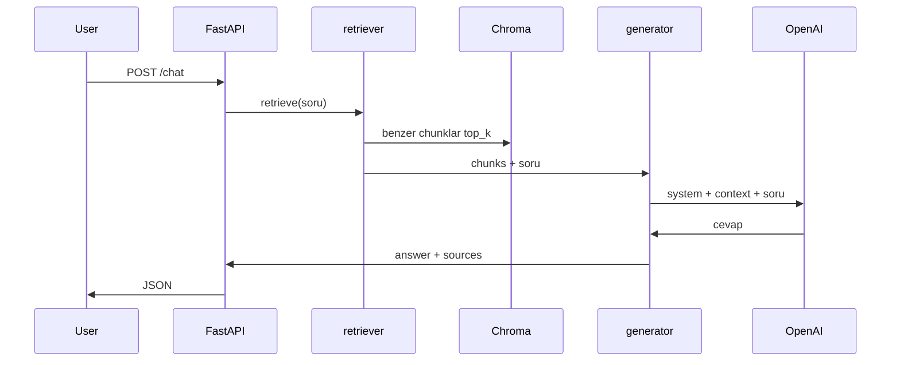

# Faz 3: RAG Pipeline

**Tarih:** 2026-05-19  
**Durum:** Tamamlandı

---

## Bu fazda ne öğrendik?

### RAG akışı (tam zincir)



1. **Retrieval:** Soru embed edilir → Chroma’da en yakın `top_k` parça (varsayılan 4).
2. **Augmentation:** Parçalar prompt’a “context” olarak eklenir.
3. **Generation:** LLM yalnızca bu bağlamda cevap üretir; kurallar system prompt’ta.

### Neden system prompt kuralları?

4B/mini modeller bazen bağlam dışı bilgi ekler. Net kurallar:
- “Sadece context”
- “Bilmiyorsan söyle”
→ Hallucination azalır (sıfır olmaz).

### `sources` alanı

API cevabında hangi MD dosyasından alıntı kullanıldığı görünür — destek botlarında güven için kritik.

---

## Dosyalar

| Dosya | Rol |
|-------|-----|
| `src/rag/retriever.py` | Soru → Chroma query |
| `src/rag/generator.py` | Context + prompt + LLM |
| `src/rag/pipeline.py` | `answer_with_rag()` |
| `src/api/routes_chat.py` | RAG veya fallback chat |

---

## Test soruları

| Soru | Beklenen |
|------|----------|
| Ücretsiz planda kaç proje var? | **3** + kaynak `02-plans` veya `07-faq` |
| Pro plan ne kadar? | **12 USD / kullanıcı / ay** |
| SSO var mı? | Enterprise, **SAML 2.0** |
| Jira Server senkron var mı? | Hayır (06-integrations) |

`/health` → `"rag_enabled": true` (index doluysa).

Örnek:

```powershell
Invoke-RestMethod -Uri http://127.0.0.1:8000/chat -Method Post `
  -ContentType "application/json" `
  -Body '{"message": "Ücretsiz planda kaç proje açabilirim?"}'
```

---

## Ayarlar (`config.py`)

- `rag_top_k = 4` — kaç chunk LLM’e gider (artırırsan daha fazla bağlam, daha yüksek maliyet)

---

## Sorun giderme

| Belirti | Çözüm |
|---------|--------|
| `rag_enabled: false` | `python scripts/ingest.py --reset` |
| Yanlış sayı | `top_k` artır veya chunk boyutunu gözden geçir |
| “Bilmiyorum” çok sık | İlgili MD dosyası var mı, ingest yenilendi mi |

---

## Sonraki faz (Faz 4)

- Rate limit, admin reindex endpoint
- İsteğe bağlı konuşma geçmişi

---

## Senin notların

```
(buraya yaz)
```
